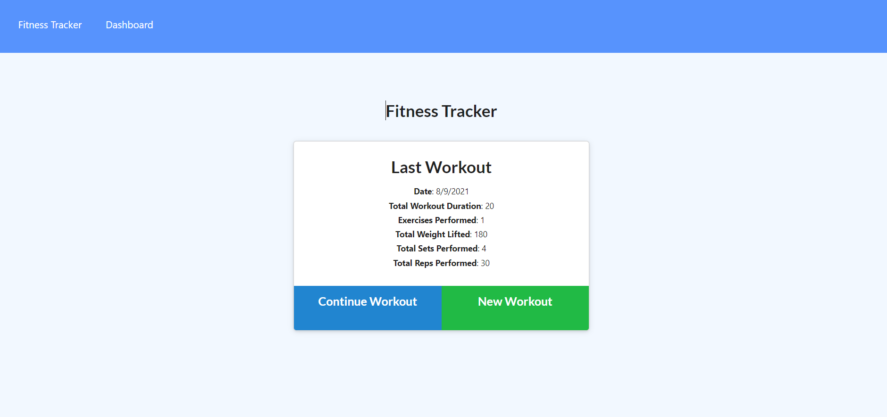

# Workout_Tracker
  
  ## Description
  This is a personalized workout tracker for your use. It requires a Mongo database with a Mongoose schema and handle routes with Express. You will be able to view, create and track daily workouts. You will be able to log multiple exercises in a workout on a given day. You should also be able to track the name, type, weight, sets, reps, and duration of exercise. If the exercise is a cardio exercise, you should be able to track your distance traveled.

  ## Demo
  <a href="https://obscure-spire-84126.herokuapp.com/?id=6111f1c1bbdf67001553b746">Heroku Link</a>

  

  

  ## Questions
  If you have any questions about the repo, open an issue or contact me directly at [jimmy.antley@gmail.com](mailto:jimmy.antley@gmail.com). You can find more of my work at [Jimmant91](https://www.github.com/Jimmant91).
